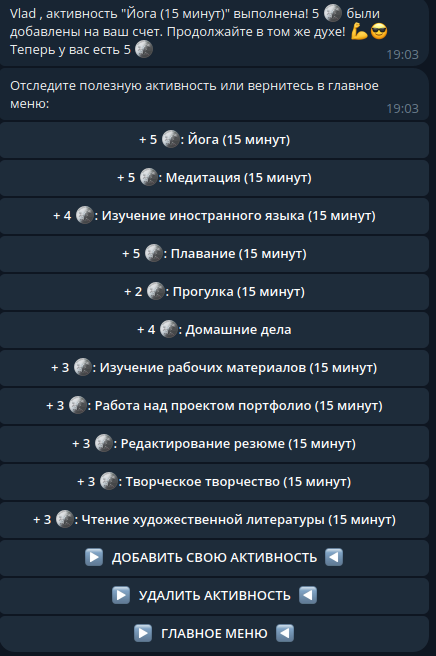

# Бот для постановки целей
Проект предназначен для ознакомления с кодом. Все секретные ключи и доступы изменены.
Проект нуждается в дольнейшей поддержке и рефакторинге.
Пример того, как выглядит постановки целей. Всё выполнено в игровой форме:



# Миграции через liquibase
Запускаем все миграции
```bash
liquibase update
```
Откат изменений миграций
```bash
liquibase rollbackCount 1 
```